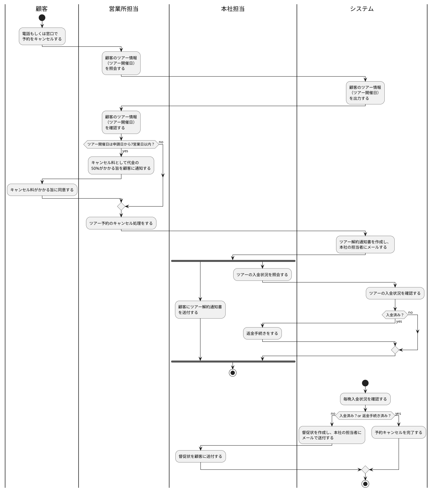

```plantuml
@startuml

|顧客|
|営業所担当|
|本社担当|
|システム|

|顧客|
start
:電話もしくは窓口で
予約をキャンセルする;

|営業所担当|
:顧客のツアー情報
（ツアー開催日）
を照会する;

|システム|
:顧客のツアー情報
（ツアー開催日）
を出力する;

|営業所担当|
:顧客のツアー情報
（ツアー開催日）
を確認する;
if(ツアー開催日は申請日から7営業日以内？) then (yes)
  :キャンセル料として代金の
  50%がかかる旨を顧客に通知する;

  |顧客|
  :キャンセル料がかかる旨に同意する;
else (no)
endif

|営業所担当|
:ツアー予約のキャンセル処理をする;

|システム|
:ツアー解約通知書を作成し、
本社の担当者にメールする;

|本社担当|
fork
  :顧客にツアー解約通知書
  を送付する;
fork again

:ツアーの入金状況を照会する;

|システム|

:ツアーの入金状況を確認する;
if (入金済み？) then (yes)
  |本社担当|
  :返金手続きをする;
else (no)
endif
end fork
stop

|システム|
start
:毎晩入金状況を確認する;
if (入金済み？or 返金手続き済み？) then (no)
  :督促状を作成し、本社の担当者に
  メールで送付する;

  |本社担当|
  :督促状を顧客に送付する;

else (yes)
  |システム|
  :予約キャンセルを完了する;
endif
stop
@enduml
```
